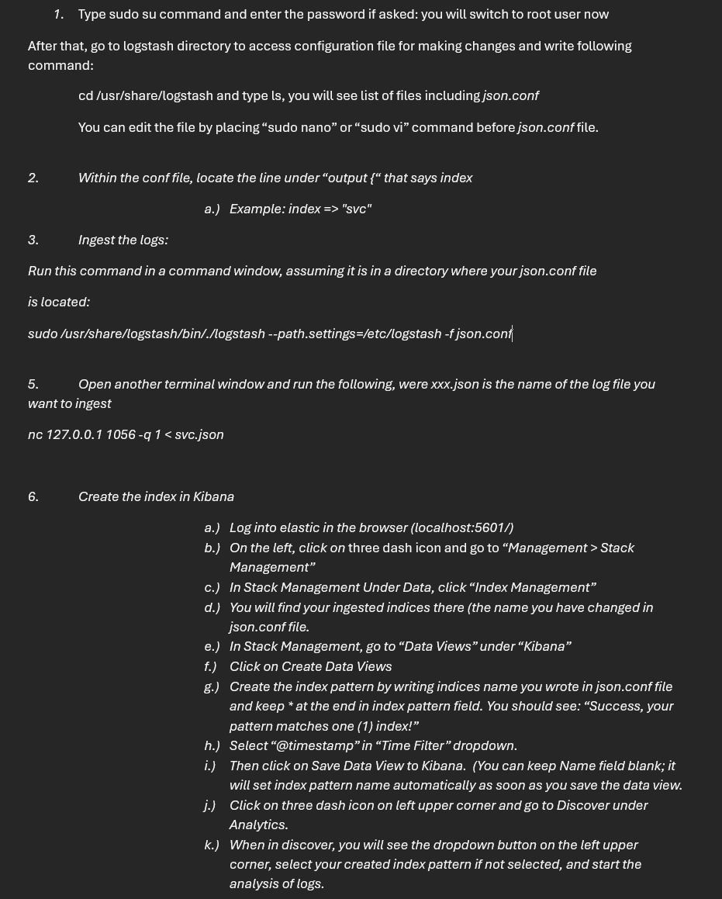
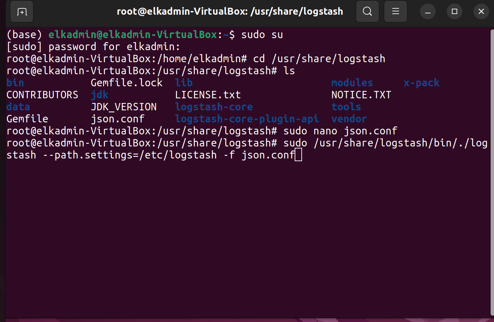
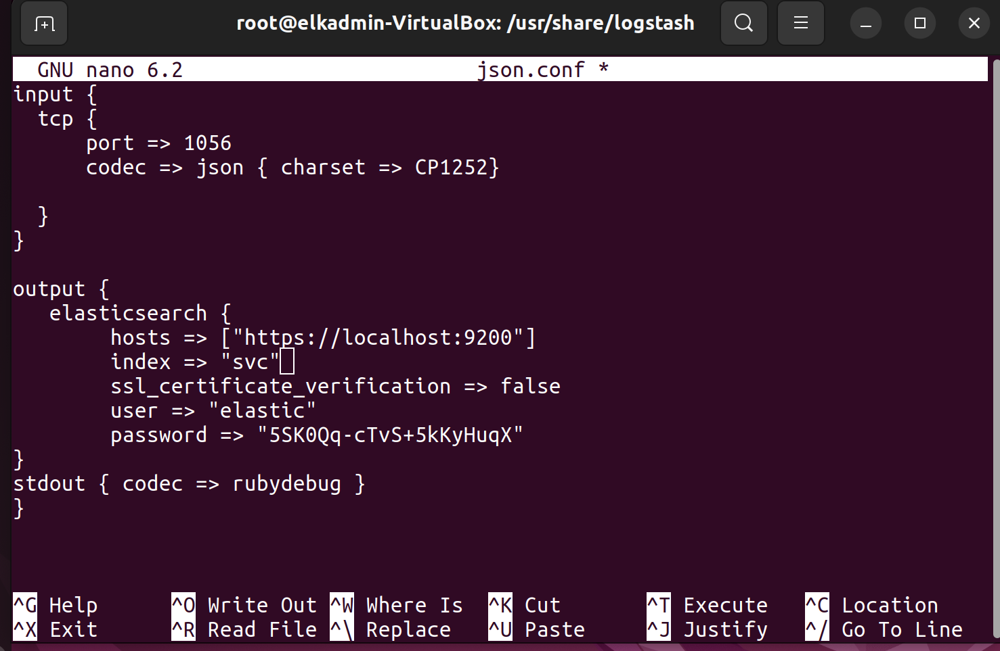
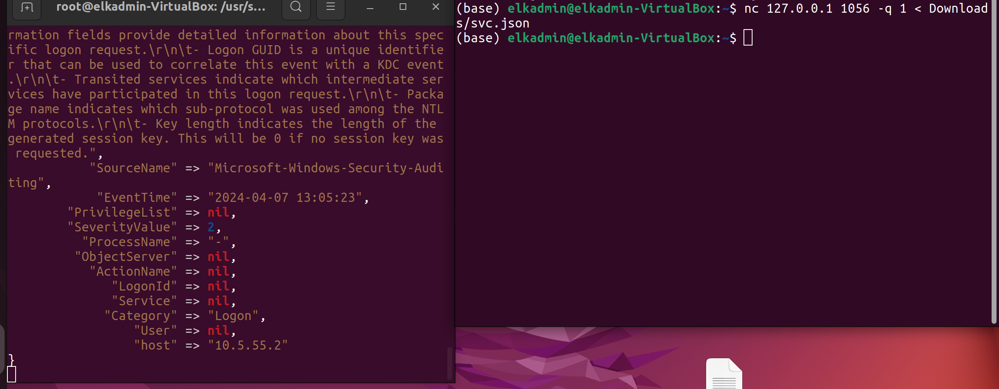
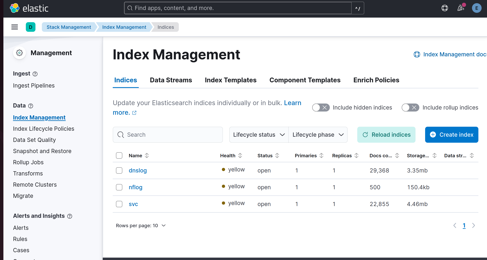
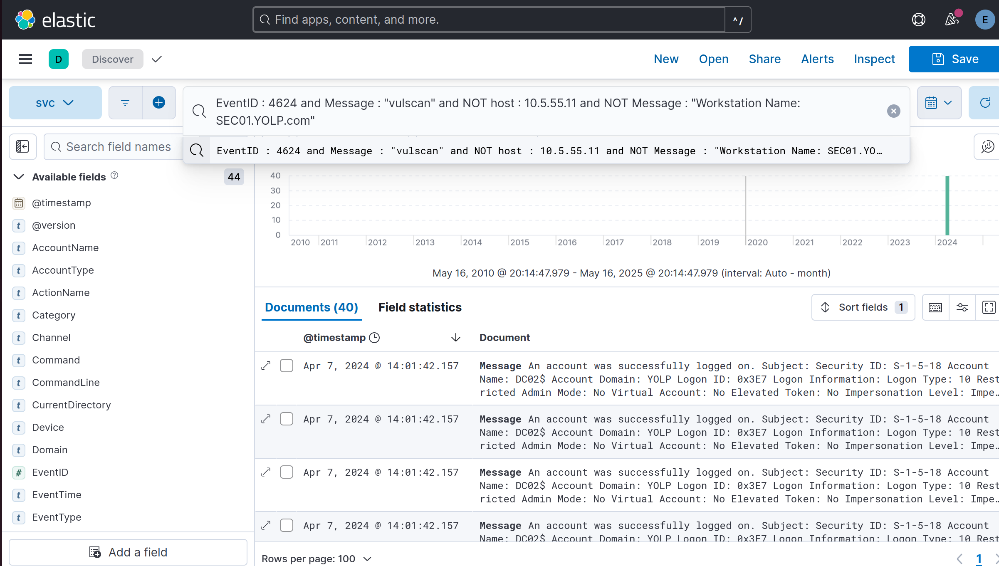
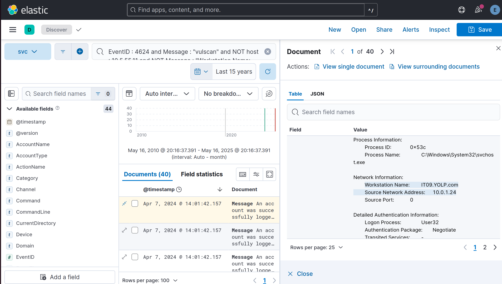
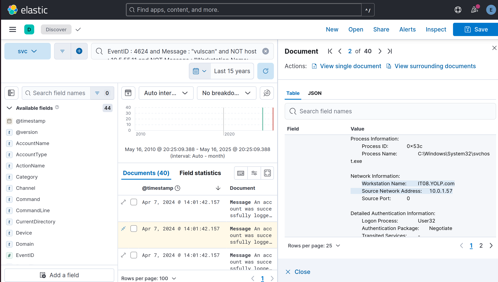

##🛡️## # SOC Analyst Project: Endpoint Detection - Login Analysis

This project demonstrates the use of Elastic Search and Kibana to analyze login activity data and detect signs of credential misuse within an enterprise environment

##📘 # Overview
YOLP.com's security team uses a commercial vulnerability scanner. The vulnerability scanner periodically logs on to every machine in the company to perform routine scanning. The vulnerability scanner is located on SEC01.YOLP.com with IP address: 10.5.55.11 . The login  id is vulscan. 
An attacker has performed a successful attack and obtained the credential of the vulnerability scanner. 
Find compromised machines by analyzing login activities of the vulnerability scanner

##🎯 # Objectives

* Detect unauthorized use of the vulscan login
* Identify potentially compromised endpoints
* Determine possible source machines used in the attack

##🧰 # Tools & Technology

* Elastic
* Kibana
* Log file (svclog) – Contains login event data

##🧪 # Analysis Workflow

##1️⃣ * Log Ingestion: Imported the svclog file into Elastic Cloud for investigation
  
 
 
 
 
 
 
##2️⃣ * Kibana Querying: Built targeted queries to isolate logins by the vulscan account
* Logic behind the query:
  Event ID 4624 (indicating successful login),
  logins using the vulscan account,
  exclusion of logins from the legitimate IP and workstation (10.5.55.11, SEC01.YOLP.com)
  
 
 
##3️⃣ * Behavioral Analysis: Reviewed timestamps, source IPs, and workstation names to identify unusual login patterns

##⚠️ * Compromised Endpoint Identification:  Pinpointed machines that were accessed using the stolen vulscan credentials outside of normal scanner behavior
  
  IT09 Workstation (15/40 entries)
  
  
  
  IT08 Workstation (5/40 entries)
  
  
  
  IT04 Workstation (20/40 entries)
  
  

* The vulscan account should only ever log in from 10.5.55.11 / SEC01.YOLP.com.
* This query returned 40 log entries, all of which represent unauthorized or suspicious logins using vulscan. Every single one of these logons is a Logon Type 10, meaning they occurred via Remote Desktop Protocol (RDP).

